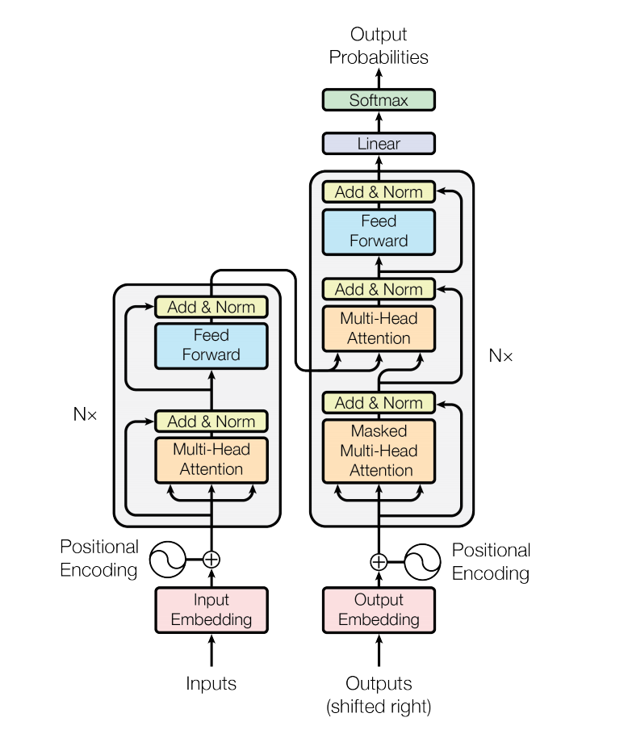

 

 
 这篇文章的思想是利用attention完成一些RNN，CNN在NLP中的工作，即提出了一个完全由attention构成的encoder-decoder的模型。具体模型如下图可以看出。

 左侧为encoder，右侧为decoder，文中attention有三种，分别为encoder内部的attention，decoder内部的attention和encoder与decoder之间的attention，attention的内部机制如下图。

\\[ MultiHead(Q,K,V) = Concat(head_1, head_2,\cdots, head_h)W^o\\]
\\[ head_i = Attention(QW_i^Q,KW_i^K,VW_i^V)\\]

这里的attention非常类似于一种一列的卷积，不同的head就像是不同的卷积核，这里是一个线性的卷积核。该方法的优点主要是速度非常快，但是在框架上感觉与普通的神经网络并没有太大的差别。
