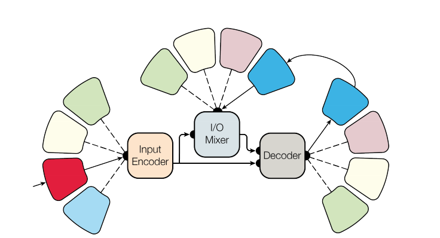
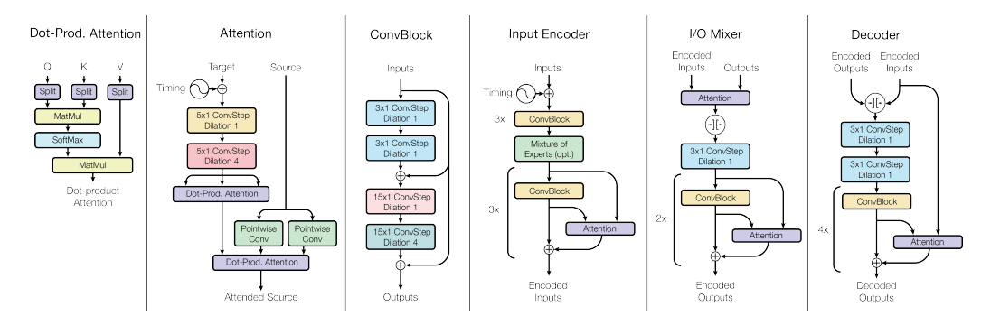

 

 
 这篇文章与Attention is all you need的作者大致相同，文中也运用到了attention里面的模型。该文章的主要想法是希望能够建立一个较为通用，能够解决多个任务的encoding - decoding的模型。文中的模型共解决了八个任务，包括Image Caption, Image classification, Machine Translation, Speech recognition等。

 文章的模型主要为下图所示。

图中不同颜色代表不同的block，分别是convolutional blocks, attention blocks(即为attention那篇文章中encoder的结构), mixture of experts blocks和一个autoregressive block，其中前三种blocks是针对于从一些处理所需任务中较好的模型中搬来的，autoregressive blocks是希望模型能够解决时间上的依赖性。之后通过Input Encoder, I/O Mixer, Decoder, 最后对于不同的任务，还需要不同的output decoder。各个blocks的结构如下图。

文中模型在处理具体的任务时需要对数据进行类似预处理的encoder，预测时也需要output decoder，不过是对于不同的任务来说，模型的结构是相同的，也就是说，对于不同的任务，模型可以attention到内部比较有利的部分。类似于一种encoder模型上的attention？不过从大体上看还是有一些task specific。在实验结果上，虽然加入了一些处理不同任务的blocks，但是对于单个任务并不会有影响，甚至在一些任务会有一些小的进步，不过这个可能是归功于参数增多的缘故吧。
