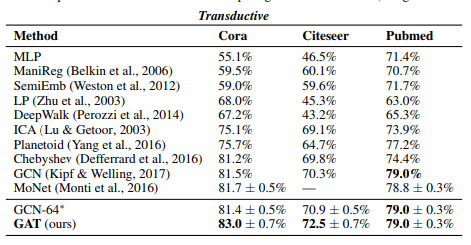
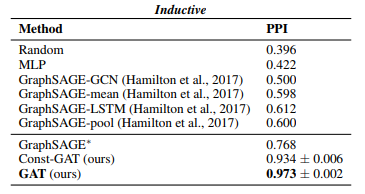

 

 
 新的一年，继续开始更新Blog。

## 文章思想

 这篇文章的主要思想是利用attention机制来代替GCNs中的卷积层，得到node embedding. 同时model可以适用于transductive和inductive两种task. 下面介绍Graph Attention Networks(GAT) 的核心结构Graph Attention layer.

 对于每一层，输入为每一个node的feature, $$\textbf{h}=\{\vec{h_1}, \vec{h_2}, \cdots, \vec{h_N}\}, \vec{h_i}\in \mathcal{R}^F$$，$$N$$为节点个数，$$F$$为输入特征维数。输出亦为每一个node的feature, $$\textbf{h'}=\{\vec{h'_1},\vec{h'_2},\cdots,\vec{h'_N}\}, \vec{h'_i}\in \mathcal{R}^{F'} $$, $${F'}$$为输出特征的维数。则attention mechanism就是在对输入特征做线性变换$$W\in \mathcal{R}^{F'\times F}$$后计算对于节点$$i$$，其周围节点（包括自身）的权重，最后加权求和通过激活函数即得到节点$$i$$的输出特征。

 则节点$$j$$对节点$$i$$的权重（可以看做节点$$j$$对于节点$$i$$的重要性）为：

 $$e_{ij}=a(W\vec{h_i}, W\vec{h_j})$$

其中$$a : \mathcal{R}^{F'}\times\mathcal{R}^{F'}\rightarrow \mathcal{R}$$为attention mechanism.

则节点$$i$$输出可由对其相邻点加权得到：

$$\begin{cases}
\alpha_{ij}=softmax_j(e_{ij})=\frac{exp(e_{ij})}{\sum_{k\in N_i}{exp(e_{ik})}} \\
\vec{h'_i}=\sigma(\sum_{j\in N_i}{\alpha_{ij}W\vec{h_j}})\\
\end{cases}$$

其中第一步为对权重的正则化，第二步为加权求和。

## 实现细节

### attention mechanism

文中的attention mechanism选取为一个单层网络：

$$
a(W\vec{h_i}, W\vec{h_j})=LeakyReLU(\vec{a}^T[W\vec{h_i} \|\| W\vec{h_j}])$$

$$\|\|$$表示concatenation, $$\vec{a}\in \mathcal{R}^{2F'}$$.

### Multi-Head attention

Multi-Head attention相当于对不同的attention mechanism进行结合。这里考虑有$$K$$个attention mechanism. 

$$\begin{cases}
\vec{h'_i}=\|\|^{K}_{k=1}\sigma(\sum_{j\in N_i}{\alpha^k_{ij}W^k\vec{h_j}})\\
\vec{h'_i}=\sigma(\frac{1}{K}\sum_{k=1}^{K}\sum_{j\in N_i}{\alpha_{ij}^kW^k\vec{h}_j})\\
\end{cases}$$

## 实验结果

主要在Cora, Citeseer, Pubmed, PPI上做了实验，这里贴一下其实验结果，实验结果还是不错的。

## Transductive vs. Inductive

这里记录一下目前对Transductive和Inductive的理解。首先是Wikipedia上对Transductive learning和Inductive learning的描述。

1. Transduction or transductive inference is reasoning from observed, specific (training) cases to specific (test) cases.
2. Induction is reasoning from observed training cases to general rules, which are then applied to the test cases.

也就是说Transductive是对special case做train, special case做test, 而Inductive是special case做train, 而general case做test. 我目前的理解上是针对图上的，比如做node classification, 从一个图中取一些点做train, 另一些点做test, train和test的点都是一个图上取的，就属于special case to special case, 因此属于transductive, 而取一些图作为train, 然后一些新的图做test, 就像PPI dataset, 就属于special case to general case, 算是inductive.

这篇paper的思路和结果都还不错，尤其是PPI的结果，比GCNs的结果高太多了。文章发表在ICLR 2017上，作者中还有大牛Yoshua Bengio.
